# 🚀 Configuración Avanzada de Nginx para LethalRun.cat

Explicación técnica completa del archivo de configuración Nginx que maneja el dominio `lethalrun.cat`, implementando arquitectura moderna con microservicios.

## 🌐 Arquitectura General

```mermaid
graph TD
    A[Cliente] --> B[80: Redirección HTTPS]
    A --> C[443: Servicio Principal]
    C --> D[Nuxt:4000]
    C --> E[Auth:3000]
    C --> F[Images:3001]
    C --> G[Socket:3002]
    C --> H[SQL:3003]
    C --> I[Mongo:3004]
```


## 🔐 Bloque de Redirección HTTPS (HTTP → HTTPS)
```bash
server {
    listen 80;
    server_name lethalrun.cat www.lethalrun.cat;
    return 301 https://$host$request_uri;
}
```

## 🔒 Configuración SSL Principal
```nginx
listen 443 ssl http2;
ssl_certificate /etc/letsencrypt/live/lethalrun.cat/fullchain.pem;
ssl_certificate_key /etc/letsencrypt/live/lethalrun.cat/privkey.pem;
include /etc/letsencrypt/options-ssl-nginx.conf;
ssl_dhparam /etc/letsencrypt/ssl-dhparams.pem;
```

## 📊 Benchmark SSL (Qualys SSL Test)
```bash
# Recomendado para A+:
ssl_protocols TLSv1.2 TLSv1.3;
ssl_prefer_server_ciphers on;
ssl_ciphers 'ECDHE-ECDSA-AES256-GCM-SHA384:ECDHE-RSA-AES256-GCM-SHA384';
ssl_ecdh_curve secp384r1;
ssl_session_timeout 10m;
ssl_session_cache shared:SSL:10m;
```

## 🖥️ Proxy Nuxt (Frontend)
```nginx
location / {
    proxy_pass http://localhost:4000;
    proxy_http_version 1.1;
    proxy_set_header Upgrade $http_upgrade;
    proxy_set_header Connection 'upgrade';
    proxy_set_header X-Real-IP $remote_addr;
    proxy_set_header X-Forwarded-For $proxy_add_x_forwarded_for;
}
```

## 🔄 Optimización WebSockets

```diff
+ proxy_http_version 1.1;  # Requerido para WS
+ proxy_set_header Upgrade $http_upgrade;
+ proxy_set_header Connection "upgrade";
```

## 🧩 Microservicios Backend

### Estructura de Rutas

```bash
https://lethalrun.cat/
├── /auth-service/    → Auth API (3000)
├── /images-service/  → CDN (3001)
├── /socket-service/  → WS (3002)
├── /sql-service/     → MySQL (3003)
└── /mongo-service/   → MongoDB (3004)
```

### Ejemplo Config Auth Service
```bash
location /auth-service/ {
    proxy_pass http://localhost:3000/;
    proxy_set_header X-Service-Type auth;
    limit_req zone=auth burst=5;
    
    # Headers especiales JWT
    proxy_set_header X-JWT-Secret $jwt_secret;
}
```

## 🛡️ Hardening de Seguridad
```nginx
# Headers de protección
add_header Strict-Transport-Security "max-age=63072000; includeSubDomains; preload";
add_header Content-Security-Policy "default-src 'self'";
add_header X-Frame-Options DENY;

# Protección contra ataques
client_body_buffer_size 1k;
client_header_buffer_size 1k;
client_max_body_size 1k;
large_client_header_buffers 2 1k;

# Timeouts
client_body_timeout 10;
client_header_timeout 10;
keepalive_timeout 5 5;
send_timeout 10;
```

## 📈 Monitoring (Ejemplo)
```nginx
log_format main '$remote_addr - $remote_user [$time_local] '
                '"$request" $status $body_bytes_sent '
                '"$http_referer" "$http_user_agent" '
                'RT=$request_time UCT="$upstream_connect_time"';

access_log /var/log/nginx/lethalrun-access.log main buffer=32k;
error_log /var/log/nginx/lethalrun-error.log warn;
```

## 🚨 Troubleshooting

### Comandos útiles:

```bash
# Testear configuración
sudo nginx -t

# Recargar sin downtime
sudo systemctl reload nginx

# Ver conexiones activas
ss -tulpn | grep nginx

# Monitorizar errores
tail -f /var/log/nginx/lethalrun-error.log
```

## 🔄 Ejemplo de CORS para Microservicios

```nginx
location /api/ {
    if ($request_method = 'OPTIONS') {
        add_header 'Access-Control-Allow-Origin' '*';
        add_header 'Access-Control-Allow-Methods' 'GET, POST, OPTIONS';
        add_header 'Access-Control-Allow-Headers' 'DNT,User-Agent,X-Requested-With,If-Modified-Since,Cache-Control,Content-Type,Range';
        add_header 'Access-Control-Max-Age' 1728000;
        add_header 'Content-Type' 'text/plain; charset=utf-8';
        add_header 'Content-Length' 0;
        return 204;
    }
}
```

## 💡 Mejoras Recomendadas

### Cache HTTP:
```nginx
location ~* \.(js|css|png|jpg|jpeg|gif|ico)$ {
    expires 1y;
    add_header Cache-Control "public, immutable";
}
```

### Load Balancing:
```nginx
upstream nuxt_cluster {
    least_conn;
    server 127.0.0.1:4000 weight=3;
    server 192.168.1.10:4000;
    server 192.168.1.11:4000 backup;
}
```

### Rate Limiting:
```nginx
limit_req_zone $binary_remote_addr zone=auth:10m rate=10r/m;
```
